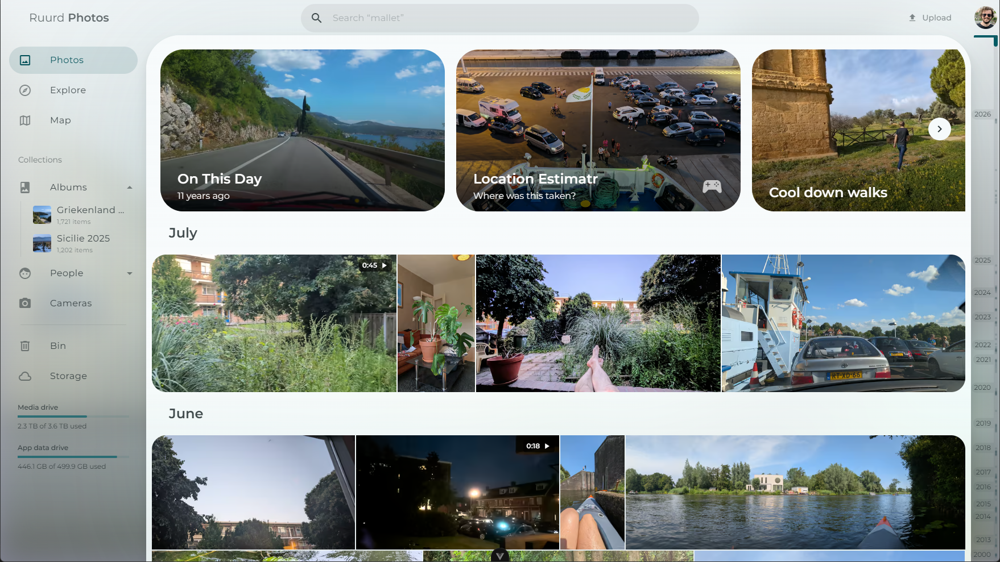
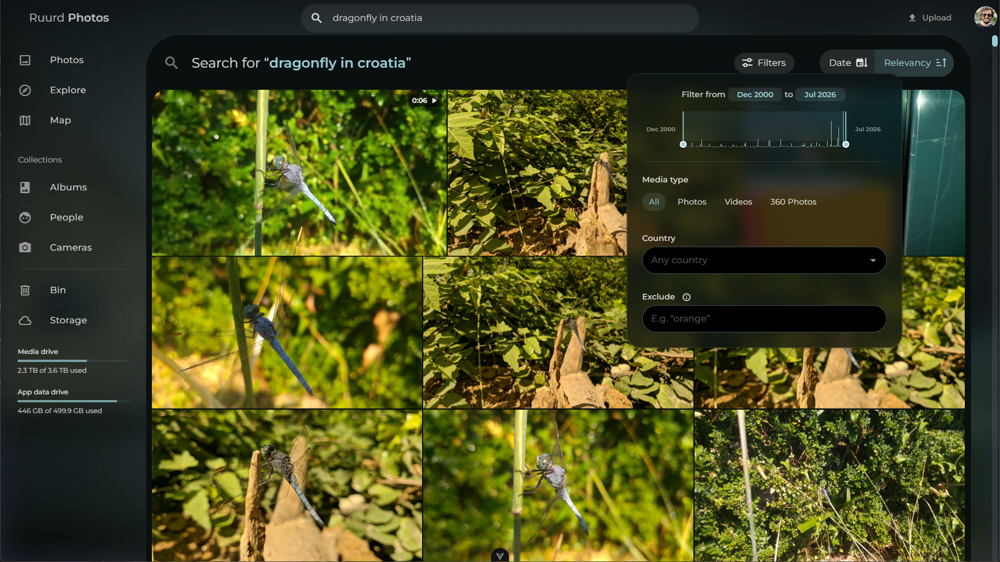
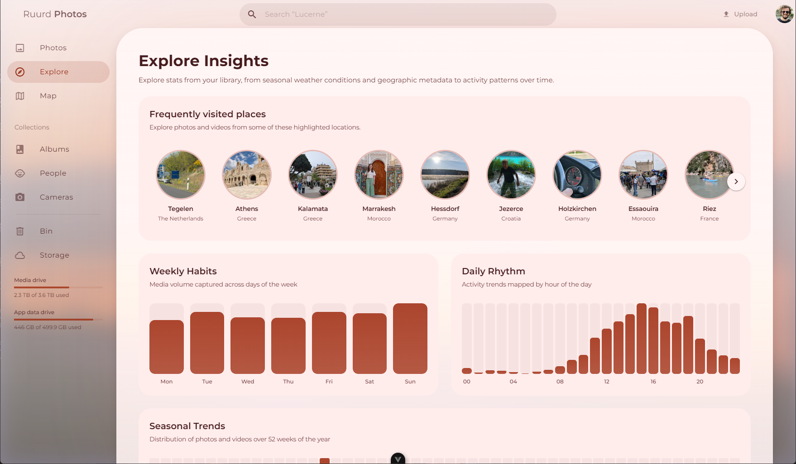
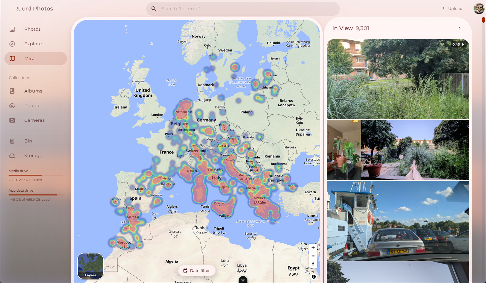
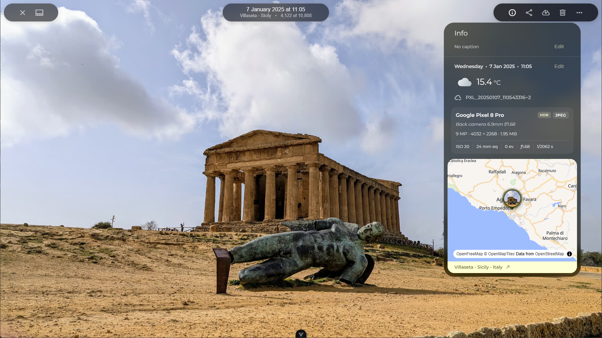
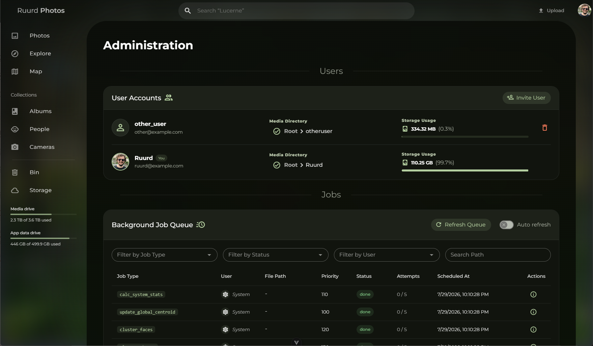

# Ruurd Photos

<p align="center">
  
  <br>
  <em>Chronological Timeline</em>
</p>

<p align="center">
  
  <br>
  <em>Search for anything</em>
</p>

<p align="center">
  
  <br>
  <em>Explore stats & locations</em>
</p>

<p align="center">
  
  <br>
  <em>Map view</em>
</p>

<p align="center">
  
  <br>
  <em>Photo info</em>
</p>

<p align="center">
  
  <br>
  <em>Admin page for user & background job management</em>
</p>

# Install

## 1. Create a directory for the application

```bash
mkdir photos-app && cd photos-app
```

## 2. Download the docker-compose.yml and example.env

```bash
wget https://github.com/ruurdbijlsma/Photos/releases/latest/download/compose.yml
wget -O .env https://github.com/ruurdbijlsma/Photos/releases/latest/download/example.env
```

## 3. Edit .env to set your MEDIA_LOCATION and JWT_SECRET, then run:

docker compose up -d

## 4. Wait for app to come online, takes longer the first launch

## 5. Visit in browser at http://localhost:9475

## 6. Create an account (register). This account will be the administrator.

## 7. Go through initial setup wizard, verify drives look right, pick user folder

* user folder must be subfolder of mounted media folder if you want multiple user support

## 8. Click start processing, your photos and videos will appear on the timeline